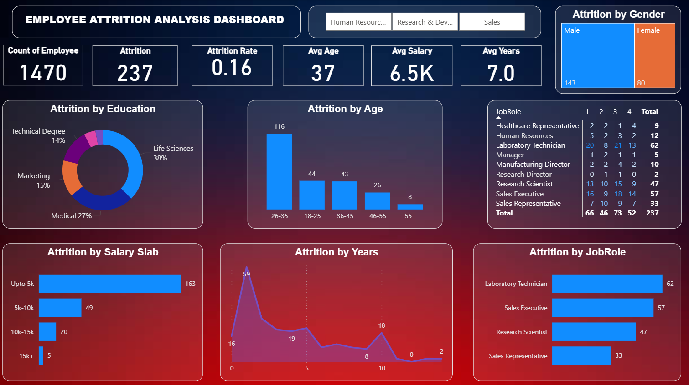

# Employee Attrition Analysis Dashboard

## 📊 What This Dashboard Is About
This **Employee Attrition Analysis Dashboard** analyzes *why employees leave an organization* and *which employee segments are most at risk*. Using a single HR dataset (`hr_analytics.csv`), the dashboard converts raw employee data into **actionable HR and business insights**.

The dashboard helps stakeholders understand attrition patterns across **age, salary, job role, experience, education, and gender**, enabling **data-driven retention strategies**.

---

## 📸 Dashboard Preview


---

## ❓ Business Questions Answered
This dashboard answers the following key questions:

1. What is the **overall attrition rate** of the organization?
2. Which **age groups** have the highest attrition?
3. How does **salary level** influence employee attrition?
4. Which **job roles** are most affected by attrition?
5. Are employees leaving more during their **early years** at the company?
6. Does attrition vary by **education background**?
7. Is there a difference in attrition across **gender**?

---

## 📌 Key KPIs (At a Glance)

| Metric | Value |
|------|------|
| Total Employees | **1,480** |
| Total Attrition | **237** |
| Attrition Rate | **16%** |
| Average Age | **37 years** |
| Average Salary | **6.5K** |
| Average Years at Company | **7.0 years** |

---

## 📈 Insights from the Dashboard

1. **Overall Attrition Trend**  
   The organization has an attrition rate of **16%**, indicating a moderate but impactful level of employee turnover that requires targeted retention strategies.

2. **Age Group Impact**  
   Employees in the **26–35 age group** experience the highest attrition, suggesting higher mobility during early-to-mid career stages.

3. **Salary-Driven Attrition**  
   A significant majority of attrition occurs in the **“Up to 5k” salary slab**, highlighting compensation as a major driver of employee exits.

4. **Job Role Concentration**  
   Attrition is most prominent among **Laboratory Technicians, Sales Executives, Research Scientists, and Sales Representatives**, indicating role-specific pressure points.

5. **Early Tenure Risk**  
   The highest attrition occurs within the **first 0–2 years** at the company, showing challenges in early engagement and onboarding.

6. **Education Background Influence**  
   Employees from **Life Sciences and Medical** education backgrounds show comparatively higher attrition, reflecting domain-driven workforce demand.

7. **Gender Difference**  
   Attrition is higher among **male employees** than female employees, pointing toward potential differences in role distribution or career mobility.

---

## 🎛 Dashboard Interactivity
- Department-level slicers (HR, R&D, Sales)
- Cross-filtering across all visuals
- Dynamic KPI updates
- Interactive job role and job level analysis

These features allow users to **drill down into specific employee segments** and explore attrition patterns interactively.

---

## 🗂 Repository Structure
```
employee-attrition-analysis-dashboard/
│
├── data/
│ └── hr_analytics.csv # HR dataset used for analysis
│
├── images/
│ └── dashboard_overview.png # Power BI dashboard screenshot
│
├── README.md
├── LICENSE
```

---

## 📁 Dataset Overview
- **File:** hr_analytics.csv
- **Records:** 1,480 employees

### Key Fields
- Demographics: Age, Gender, MaritalStatus, Education, EducationField  
- Job Details: Department, JobRole, JobLevel, JobInvolvement  
- Compensation: MonthlyIncome, SalarySlab, HourlyRate  
- Experience: TotalWorkingYears, YearsAtCompany, YearsInCurrentRole  
- Satisfaction & Performance: JobSatisfaction, EnvironmentSatisfaction, PerformanceRating  
- Target Variable: Attrition (Yes / No)

---

## 🧩 Skills Demonstrated
- Data cleaning & preparation (Excel)
- Exploratory Data Analysis (EDA)
- HR & People Analytics
- KPI definition & tracking
- Power BI dashboard design & storytelling
- Business insight communication

---

## 🛠 Tools & Technologies
- Microsoft Excel – Data cleaning & preprocessing
- Power BI – Interactive dashboard & visualization
- CSV Dataset – Single source of truth

---

## 📄 License
This project is licensed under the **MIT License**.

---

## 👤 Author
**Aditya Sharma**  
Aspiring Data Analyst | SQL | Python | Power BI | Excel  

GitHub: https://github.com/aditya-datahub
